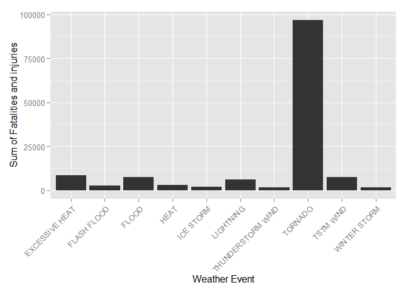
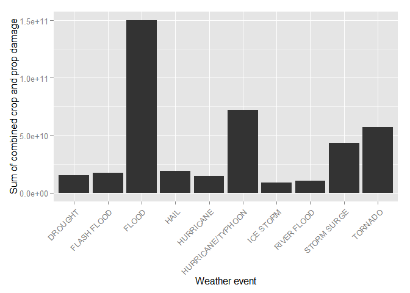

# Reproducible Research: Peer Assessment 2


## Loading and preprocessing the data
Load the repdata-data-StormData.csv.bz2 file into workspace.

```r
library("R.utils")
```

```
## Warning: package 'R.utils' was built under R version 3.1.2
```

```
## Loading required package: R.oo
```

```
## Warning: package 'R.oo' was built under R version 3.1.2
```

```
## Loading required package: R.methodsS3
```

```
## Warning: package 'R.methodsS3' was built under R version 3.1.2
```

```
## R.methodsS3 v1.6.1 (2014-01-04) successfully loaded. See ?R.methodsS3 for help.
## R.oo v1.18.0 (2014-02-22) successfully loaded. See ?R.oo for help.
## 
## Attaching package: 'R.oo'
## 
## The following objects are masked from 'package:methods':
## 
##     getClasses, getMethods
## 
## The following objects are masked from 'package:base':
## 
##     attach, detach, gc, load, save
## 
## R.utils v1.34.0 (2014-10-07) successfully loaded. See ?R.utils for help.
## 
## Attaching package: 'R.utils'
## 
## The following object is masked from 'package:utils':
## 
##     timestamp
## 
## The following objects are masked from 'package:base':
## 
##     cat, commandArgs, getOption, inherits, isOpen, parse, warnings
```

```r
if (!file.exists("./repdata-data-StormData.csv")) {        
        fileURL <- "https://d396qusza40orc.cloudfront.net/repdata%2Fdata%2FStormData.csv.bz2"
        dest <- "./repdata-data-StormData.csv.bz2"
        download.file(fileURL, dest)
        bunzip2("./repdata-data-StormData.csv.bz2")
}
```
        
## Read data
Read the repdata-data-Stormdata.csv into data frame.

```r
data <- read.table("./repdata-data-StormData.csv", header = TRUE, sep = ",", na.strings = "", comment.char = "#")
cnames <-readLines("./repdata-data-StormData.csv", 1)
cnames <- strsplit(cnames, ",", fixed = TRUE)
cnames <- make.names(cnames[[1]])
cnames<-gsub("(.*)\\.", "\\1", cnames)
cnames<-gsub("_", "", cnames)
names(data) <- cnames
```
## Which types of events are most harmful with respect to population health?
Convert data to data table.

```r
library("data.table")
dt <- data.table(data)
```
Summarise fatalities then group by event type. Order by sum and display the top five items.

```r
dataFatal <- dt[, list(sum=sum(X.FATALITIES)), by = X.EVTYPE]
dataFatal <- dataFatal[rev(order(dataFatal$sum))]
head(dataFatal)
```

```
##          X.EVTYPE  sum
## 1:        TORNADO 5633
## 2: EXCESSIVE HEAT 1903
## 3:    FLASH FLOOD  978
## 4:           HEAT  937
## 5:      LIGHTNING  816
## 6:      TSTM WIND  504
```

```r
dataFatal10 <- dataFatal[1:10]
```
We can see that tornado is causing the highest sum of fatalities with 5633 fatalities.

Summarise injuries then group by event type. Order by sum and display the top five items.

```r
dataInjury <- dt[, list(sum=sum(X.INJURIES)), by = X.EVTYPE]
dataInjury <- dataInjury[rev(order(dataInjury$sum))]
head(dataInjury)
```

```
##          X.EVTYPE   sum
## 1:        TORNADO 91346
## 2:      TSTM WIND  6957
## 3:          FLOOD  6789
## 4: EXCESSIVE HEAT  6525
## 5:      LIGHTNING  5230
## 6:           HEAT  2100
```

```r
dataInjury10 <- dataInjury[1:10]
```
We can see that tornado is causing the highest sum of injuries with 91346 injuries.

Summarise both fatalities and injuries and group by event type. Order by sum and display the top five items.

```r
dataCombined <- dt[, list(sum=sum(X.FATALITIES, X.INJURIES)), by = X.EVTYPE]
dataCombined <- dataCombined[rev(order(dataCombined$sum))]
head(dataCombined)
```

```
##          X.EVTYPE   sum
## 1:        TORNADO 96979
## 2: EXCESSIVE HEAT  8428
## 3:      TSTM WIND  7461
## 4:          FLOOD  7259
## 5:      LIGHTNING  6046
## 6:           HEAT  3037
```

```r
dataCombined10 <- dataCombined[1:10]
```
We can see that Tornado is causing the highest total sum of fatalities and injuries with 96979 occurences.

## Which types of events have the greatest economic consequences?
Let us load the plyr package.

```r
library(plyr)
```

Let us extract dataProp and dataCrop containing the data needed for analysis.

```r
dataProp <- ddply(data, .(X.EVTYPE,X.PROPDMGEXP),function(x) sum(x$X.PROPDMG))
colnames(dataProp)[3] <- "Count"
dataCrop <- ddply(data, .(X.EVTYPE,X.CROPDMGEXP),function(x) sum(x$X.CROPDMG))
colnames(dataCrop)[3] <- "Count"
```

Let us summarize dataProp and dataCrop.

```r
summary(dataProp)
```

```
##                X.EVTYPE     X.PROPDMGEXP     Count        
##  THUNDERSTORM WINDS:  14   K      :371   Min.   :      0  
##  HAIL              :  13   M      :131   1st Qu.:      0  
##  TORNADO           :  11   B      : 19   Median :      0  
##  FLASH FLOOD       :   9   0      : 15   Mean   :   7842  
##  LIGHTNING         :   8   5      :  8   3rd Qu.:     17  
##  HIGH WIND         :   6   (Other): 39   Max.   :3163480  
##  (Other)           :1327   NA's   :805
```


```r
summary(dataCrop)
```

```
##                X.EVTYPE     X.CROPDMGEXP     Count       
##  THUNDERSTORM WINDS:   7   K      :135   Min.   :     0  
##  DROUGHT           :   5   M      : 73   1st Qu.:     0  
##  HAIL              :   5   B      :  6   Median :     0  
##  FLASH FLOODING    :   4   0      :  5   Mean   :  1173  
##  FLOOD/FLASH FLOOD :   4   k      :  4   3rd Qu.:     0  
##  FREEZE            :   4   (Other):  5   Max.   :576707  
##  (Other)           :1146   NA's   :947
```

Let us do some data cleaning by removing null and empty values.

```r
dataProp <- dataProp[complete.cases(dataProp$X.PROPDMGEXP),]
dataCrop <- dataCrop[complete.cases(dataCrop$X.CROPDMGEXP),]
```

Substitute exponential values (H/K/M/B)

```r
dataProp$X.PROPDMGEXP<-sapply(as.character(dataProp$X.PROPDMGEXP),switch,'M'=10^6,'m'=10^6,'K'=10^3,'k'= 10^3,'B'=10^9,'0' = 0, '2' = 2)
dataCrop$X.CROPDMGEXP<-sapply(as.character(dataCrop$X.CROPDMGEXP),switch,'M'=10^6,'m'=10^6,'K'=10^3,'k'= 10^3,'B'=10^9,'h'= 100, 'H' = 100, '0'=0,'1'=1,'2'=2,'3'=3,'4'=4,'5'=5,'6'=6,'7'=7, '8'=8)
```

Remove NULL values

```r
dataProp <- dataProp[!sapply(dataProp$X.PROPDMGEXP,is.null),]
dataCrop <- dataCrop[!sapply(dataCrop$X.CROPDMGEXP,is.null),]
```

Calculate total property damage for crop and prop.

```r
totalPropDamage <- ddply(dataProp, .(X.EVTYPE), function(x) sum(as.numeric(x$X.PROPDMG)*x$Count))
totalCropDamage <- ddply(dataCrop, .(X.EVTYPE), function(x) sum(as.numeric(x$X.CROPDMG)*x$Count))
colnames(totalPropDamage)[2] <- "Count"
colnames(totalCropDamage)[2] <- "Count"
```

Calculate the combined damage

```r
totalCombinedDamage <- rbind(totalCropDamage,totalPropDamage)
totalCombinedDamage <- ddply(totalCombinedDamage,.(X.EVTYPE), function(x) sum(x$Count))
colnames(totalCombinedDamage)[2] <- "Count"
```

Sort our data

```r
sortedPropDamage <- totalPropDamage[with(totalPropDamage,order(Count,decreasing = TRUE)),]
sortedCropDamage <- totalCropDamage[with(totalCropDamage,order(Count,decreasing = TRUE)),]
sortedCombinedDamage <- totalCombinedDamage[with(totalCombinedDamage,order(Count,decreasing = TRUE)),]
sortedPropDamage10 <- sortedPropDamage[1:10,]
sortedCropDamage10 <- sortedCropDamage[1:10,]
sortedCombinedDamage10 <- sortedCombinedDamage[1:10,]
```
We can see that for the combined damage (crop + prop) flood caused 150 Billion USD damage.
For crop damage drought caused 13 Billion USD damage and for prop flood caused 145 Billion USD damage.

## Results

### Population health
From our analysis we can conclude that the most dangerous weather event was tornado with 5633 fatalities and 91345 injuries.

```r
library(ggplot2)
library(grid)
install.packages("gridExtra", repos="http://cran.rstudio.com/")
```

```
## Installing package into 'C:/Users/hakan.silfvernagel/Documents/R/win-library/3.1'
## (as 'lib' is unspecified)
```

```
## package 'gridExtra' successfully unpacked and MD5 sums checked
## 
## The downloaded binary packages are in
## 	C:\Users\hakan.silfvernagel\AppData\Local\Temp\RtmpoTW2Yd\downloaded_packages
```

```r
library(gridExtra)
```

```
## Warning: package 'gridExtra' was built under R version 3.1.2
```

```r
plotTop10Health <- ggplot(dataCombined10,aes(x= X.EVTYPE,y = sum))
plotTop10Health <- plotTop10Health+geom_bar(stat="identity") + theme(axis.text.x = element_text(angle = 45, hjust = 1)) + xlab("Weather Event") + ylab("Sum of Fatalities and injuries") 
grid.arrange(plotTop10Health,ncol = 1)
```

 

### Population health
From our analysis we can conclude that flood caused the highest combined damage with 150 Billion USD.

```r
plotTop10Damage <- ggplot(sortedCombinedDamage10,aes(x= X.EVTYPE,y = Count))
plotTop10Damage <- plotTop10Damage+geom_bar(stat="identity") + theme(axis.text.x = element_text(angle = 45, hjust = 1)) + xlab("Weather event") + ylab("Sum of combined crop and prop damage") 
grid.arrange(plotTop10Damage,ncol = 1)
```

 
